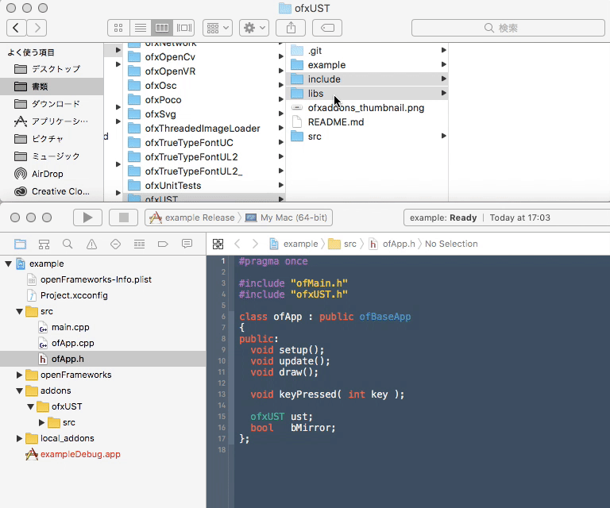

# ofxUST
Addon for using HOKUYO AUTOMATIC range sensor [UST Series](http://www.hokuyo-aut.co.jp/search/single.php?serial=16) on openFrameworks.

# Install Library
Download latest URG library from [here](https://sourceforge.net/projects/urgnetwork/files/urg_library/).

For Mac  
Enter the following commands to terminal.  
`$ cd /path/to/download/urg_library`  
`$ make`  
`$ make install`  

# Generate Project
Addons: ofxUST  
Generate  
  
Drag & drop ofxUST/include and ofxUST/libs into addons/ofxUST on project navigator.  
  
Drag & drop addons/ofxUST/libs/liburg_cpp.so into "Build Phases > Link Binary With Libraries".  
  
  

# Connection
Connect the sensor to the power supply.  
Connect sensor's LAN cable to your PC.  
Set the IP address according to the IP address of the device.  
